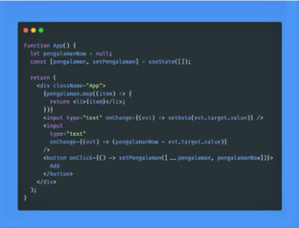

# REACT LANJUTAN 

## REACT HOOKS
React Hooks : Merupakan fitur react js yang memudahkan penggunaan functional component agar bisa menggunakan state dan lifecycle lainnya.

- ## Penggunaan useState Hooks

- ## Penggunakan Array dalam useState

-  ### Berdasarkan gambar di atas akan menghasilkan 

- ## Penggunaan PropTypes pada Hooks

 

    import PropTypes from 'prop-types';

    class Greeting extends React.Component {
    render() {
    return (
            <h1>Hello, {this.props.name}</h1>
            );
        }
    }

    Greeting.propTypes = {
    name: PropTypes.string
    };
 

# REACT ROUTER 6
- ## Menginstalasi React Router 6

Sebagian besar proyek React modern mengelola dependensinya menggunakan manajer paket seperti npm atau Yarn. Untuk menambahkan React Router ke proyek yang sudah ada, hal pertama yang harus Anda lakukan adalah menginstal dependensi yang diperlukan dengan alat pilihan Anda:

1. npm : $ npm install react-router-dom@6
2. Yarn : $ yarn add react-router-dom@6

- ## Membuat project

Setelah React Router diinstal sebagai dependensi, buka src/index.js di editor teks Anda. Impor BrowserRouter dari react-router-dom di dekat bagian atas file Anda dengan contoh :

    import * as React from "react";
    import ReactDOM from "react-dom/client";
    import { BrowserRouter } from "react-router-dom";
    import "./index.css";
    import App from "./App";
    import reportWebVitals from "./reportWebVitals";

    const root = ReactDOM.createRoot(
    document.getElementById("root")
    );
    root.render(
    <React.StrictMode>
        <BrowserRouter>
        <App />
        </BrowserRouter>
    </React.StrictMode>
    );

Sekarang kita dapat menggunakan React Router di mana saja di aplikasi kita. 

Ada beberapa contoh jenis dari Route yaitu :

1. Route dasar
2. Dynamic Route
3. Nested Route

# REDUX

Redux adalah sebuah aplikasi state management. State management adalah cara untuk memfasilitasi komunikasi dan berbagai data lintas komponen.

## Komponen pada Redux
1. Action
2. Reducer

adalah fungsi murni yang mengambil status aplikasi saat ini. Reducer juga berfungsi untuk melakukan tindakan,dan mengembalikan status baru (new state).

Contoh :

    const LoginComponent = (state = initialState, action) => {
    switch (action.type) {

    // Reducer ini menghandle Action dengan “Login”
    case "LOGIN":
    return state.map(user => {
    if (user.username !== action.username) {
    return user;
    }

    if (user.password == action.password) {
    return {
    ...user,
    login_status: "LOGGED IN"
    }
    }
    });
    default:
    return state;
    }
    };

3. Store 

berfungsi untuk menyimpan status aplikasi. Sangat disarankan untuk hanya menyimpan satu store di aplikasi Redux apa pun

Contoh : 

    class App extends React.Component {
    render() {
    return (

    )
    }
    }

## Menjalankan Redux

1. Creat App
2. install package/ dependecies yang dibutuhkan

    npm install redux react-redux redux-devtools-extension
3. Membuat folder store yang terdapat 3 file di dalamnya
- Folder actions
-  Folder Reducers
-  File 'store.js'

4. tambahkan 1 file core dengan index.js di dalam folder action

5. pada folder action tambahkan file yang dibutuhkan seperti index.js, ModeAction.js dan TodoAction.js

6. pada folder Reducer tambahkan file yang dibutuhkan seperti index.js, ModeReducer.js dan TodoReducer.js
